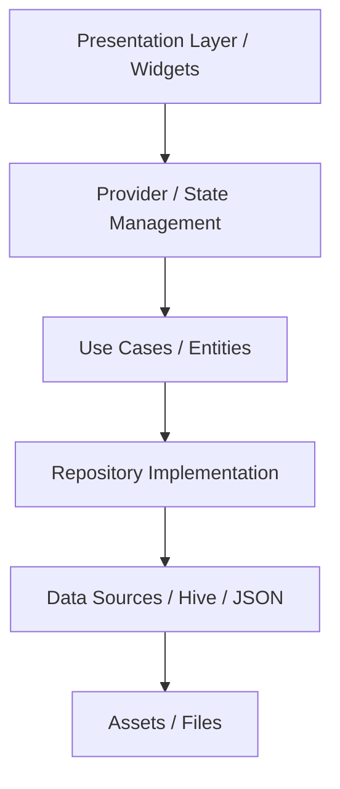
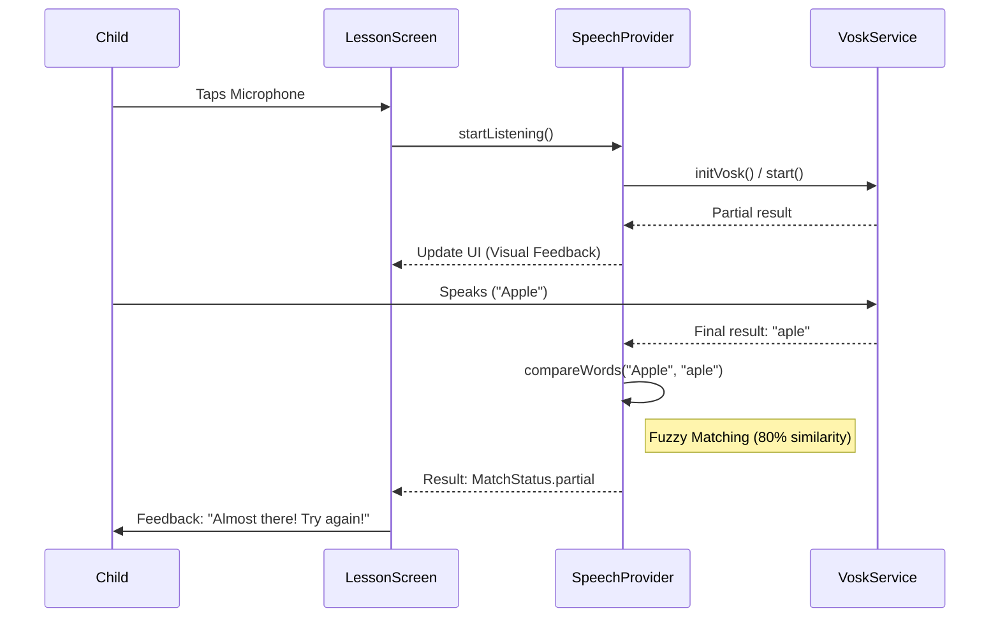

# iRead: Technical Architecture

This document provides a deep dive into the technical design, data flow, and key integration points of the iRead application.

---

## 🏗️ Architectural Pattern

iRead is built using a **Clean Architecture** approach with **Provider** for state management. This separation of concerns ensures that business logic remains independent of the UI and data sources.

### High-Level Diagram

---

## 🔊 Speech Recognition Flow

The speech recognition feature is a critical component of the learning experience. It is designed to be **offline-first** and **child-friendly**.

### Sequence Diagram

### Fuzzy Matching Logic

We use the **Levenshtein Distance** algorithm to compare the target word with the recognized speech.

- **Distance Calculation**: The number of single-character edits required to change one word into another.
- **Threshold**: `Similarity = 1 - (Distance / MaxLength)`. If `Similarity >= 0.8`, it counts as a match/partial match.

---

## 💾 Local Storage (Hive)

Hive is used for high-performance NoSQL storage on the device.

### Data Models

1. **UserProgress**: Stores completion status, stars earned, and attempt count for each unit.
2. **UserSettings**: Stores language preference, volume settings, and basic profile info.

### Box Structure

| Box Name | Key | Value |
| :--- | :--- | :--- |
| `settings` | `isFirstRun` | bool |
| `progress` | `eng_vowel_a` | Map<String, dynamic> |

---

## 🎵 Rive Integration

iRead uses **Rive** for interactive, vector-based animations that react to user input.

- **Antfly (Mascot)**: Located in `assets/rive/antfly.riv`. It has an "idle" state and a "happy" state triggered when the child succeeds.
- **Dynamic Playback**: Controlled via the `RiveAnimation` widget with state machine inputs.

---

## 📑 Data Source Lifecycle

The app's content is initialized from a master JSON file but can be overridden by user edits (in Teacher Mode).

1. **Load**: `assets/data/lessons.json` is parsed on startup.
2. **Merge**: Any local overrides from Hive are applied to the in-memory tree.
3. **Display**: The UI reacts to the merged data structure.

---

## 📈 Error Handling Strategy

- **Graceful Fallbacks**: If Vosk fails to initialize, the app falls back to the native `speech_to_text` package (if online).
- **Missing Assets**: Image and audio loading use error builders to display placeholders instead of crashing.
- **Constraint Handling**: UI layout uses `Flexible` and `Expanded` widgets to handle different screen sizes and potential text overflows.

---

## 🛣️ Navigation & Routing

The app uses **Named Routes** for clear navigation management.

- `/splash`: Initial loading and initialization.
- `/language`: Entry point after onboarding.
- `/category`: Main navigation hub.
- `/unit`: List of available sounds/letters.
- `/lesson`: Interactive player.
- `/teacher-login`: PIN-protected gateway.
- `/teacher-dashboard`: Content editor.

---

*Documentation last updated: January 2026*
